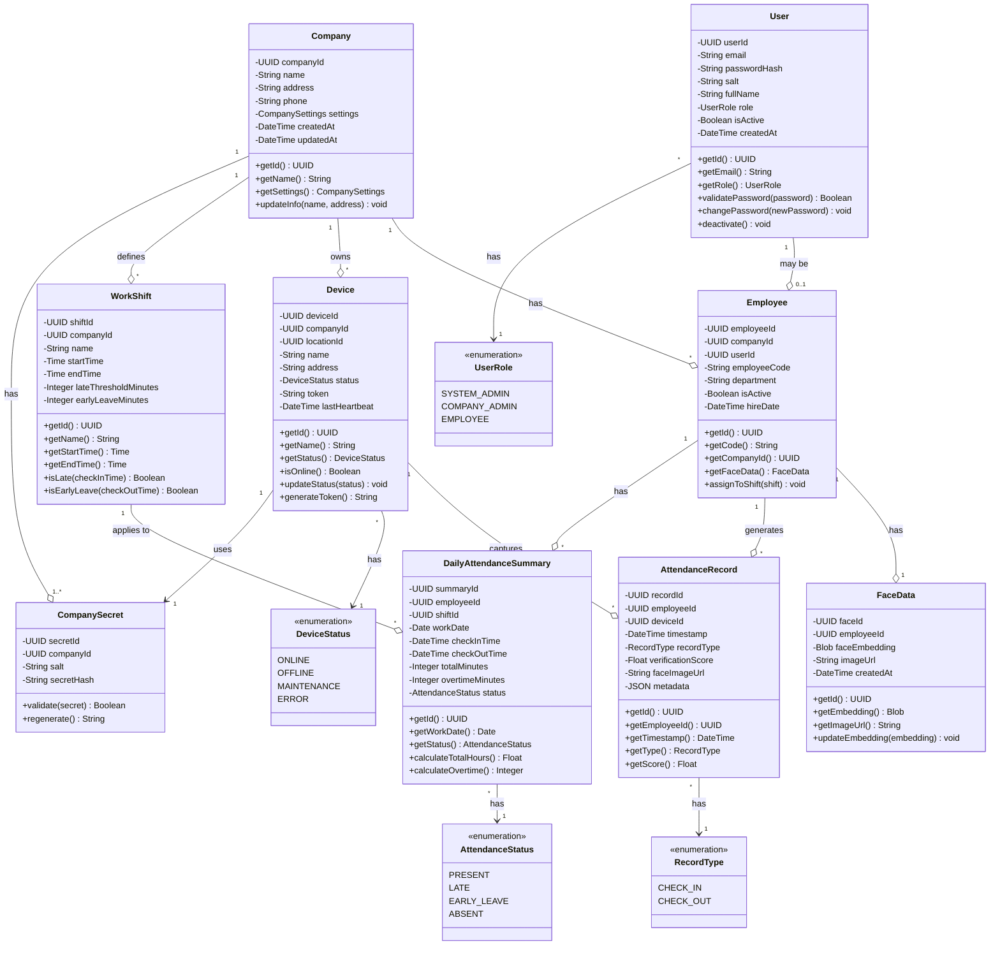
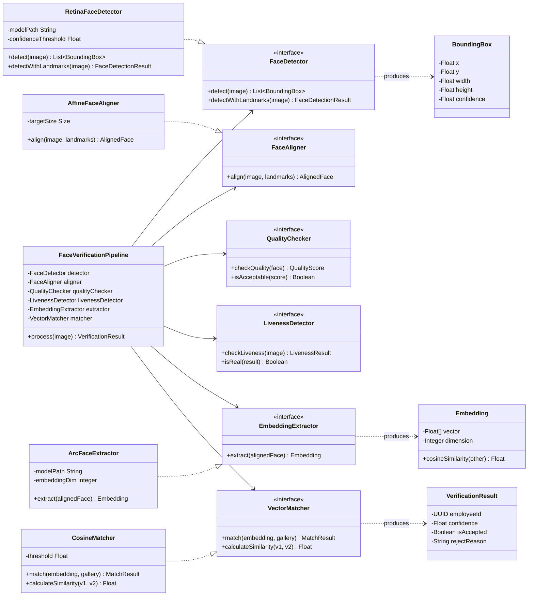

# Class Diagram - Hệ thống Chấm công Khuôn mặt SaaS

## Mô tả

Biểu đồ lớp (Class Diagram) cho Chapter 2, thể hiện cấu trúc các lớp thực thể (Entity Classes) và các lớp Service trong hệ thống.

---

## Figure 2.1 – Domain Entity Class Diagram (Mermaid)

---

## Figure 2.2 – Service Layer Class Diagram (Mermaid)

```mermaid
classDiagram
    direction TB
    
    %% ==================== SERVICE INTERFACES ====================
    
    class IAuthService {
        <<interface>>
        +login(email, password) AuthResponse
        +logout(token) void
        +refreshToken(refreshToken) AuthResponse
        +activateDevice(activationCode) DeviceToken
        +getCurrentUser(token) User
    }
    
    class IIdentityService {
        <<interface>>
        +listCompanies(filter) List~Company~
        +createCompany(data) Company
        +getCompany(id) Company
        +updateCompany(id, data) Company
        +deleteCompany(id) void
        +listUsers(companyId) List~User~
        +createUser(data) User
        +updateUser(id, data) User
        +deleteUser(id) void
    }
    
    class IDeviceService {
        <<interface>>
        +listDevices(companyId) List~Device~
        +createDevice(data) Device
        +getDevice(id) Device
        +updateDevice(id, data) Device
        +deleteDevice(id) void
        +updateStatus(id, status) void
    }
    
    class IWorkforceService {
        <<interface>>
        +listShifts(companyId) List~WorkShift~
        +createShift(data) WorkShift
        +updateShift(id, data) WorkShift
        +deleteShift(id) void
        +assignEmployeeToShift(employeeId, shiftId) void
    }
    
    class IAttendanceService {
        <<interface>>
        +checkIn(deviceId, faceImage) AttendanceResult
        +checkOut(deviceId, faceImage) AttendanceResult
        +getRecords(filter) List~AttendanceRecord~
        +getRecord(id) AttendanceRecord
        +getEmployeeHistory(employeeId) List~AttendanceRecord~
    }
    
    class IFaceVerificationService {
        <<interface>>
        +detectFace(image) FaceDetectionResult
        +extractEmbedding(alignedFace) Embedding
        +matchFace(embedding, companyId) MatchResult
        +checkLiveness(image) LivenessResult
    }
    
    class IAnalyticsService {
        <<interface>>
        +getDailyReport(companyId, date) DailyReport
        +getMonthlySummary(companyId, month) MonthlySummary
        +exportReport(type, params) ReportFile
    }
    
    class ISignatureService {
        <<interface>>
        +uploadSignature(userId, file) Signature
        +getSignatures(userId) List~Signature~
        +deleteSignature(id) void
    }
    
    class INotificationService {
        <<interface>>
        +pushAttendanceResult(deviceId, result) void
        +pushDeviceStatus(deviceId, status) void
        +pushAdminAlert(companyId, alert) void
    }
    
    %% ==================== SERVICE IMPLEMENTATIONS ====================
    
    class AuthService {
        -UserRepository userRepo
        -TokenService tokenService
        -PasswordEncoder encoder
        +login(email, password) AuthResponse
        +logout(token) void
        +refreshToken(refreshToken) AuthResponse
    }
    
    class IdentityService {
        -CompanyRepository companyRepo
        -UserRepository userRepo
        -EmployeeRepository employeeRepo
        -FaceDataRepository faceRepo
    }
    
    class AttendanceService {
        -AttendanceRepository attendanceRepo
        -FaceVerificationService faceService
        -WorkforceService workforceService
        -EventPublisher eventPublisher
        +checkIn(deviceId, faceImage) AttendanceResult
        +checkOut(deviceId, faceImage) AttendanceResult
    }
    
    class FaceVerificationService {
        -FaceDetector detector
        -FaceAligner aligner
        -EmbeddingExtractor extractor
        -VectorMatcher matcher
        -LivenessChecker livenessChecker
    }
    
    class AnalyticsService {
        -SummaryRepository summaryRepo
        -ReportGenerator reportGenerator
        -EventConsumer eventConsumer
    }
    
    %% ==================== RELATIONSHIPS ====================
    
    AuthService ..|> IAuthService
    IdentityService ..|> IIdentityService
    AttendanceService ..|> IAttendanceService
    FaceVerificationService ..|> IFaceVerificationService
    AnalyticsService ..|> IAnalyticsService
    
    AttendanceService --> IFaceVerificationService : uses
    AttendanceService --> IWorkforceService : uses
    AttendanceService --> INotificationService : publishes to
    
    AnalyticsService --> INotificationService : subscribes from
```

---

## Figure 2.3 – Face Verification Pipeline Classes (Mermaid)

---

## Figure 2.4 – Repository Layer Class Diagram (Mermaid)

```mermaid
classDiagram
    direction TB
    
    class IRepository~T~ {
        <<interface>>
        +findById(id) T
        +findAll() List~T~
        +save(entity) T
        +update(entity) T
        +delete(id) void
    }
    
    class ICompanyRepository {
        <<interface>>
        +findById(id) Company
        +findByName(name) Company
        +findAllActive() List~Company~
    }
    
    class IUserRepository {
        <<interface>>
        +findById(id) User
        +findByEmail(email) User
        +findByCompanyId(companyId) List~User~
    }
    
    class IEmployeeRepository {
        <<interface>>
        +findById(id) Employee
        +findByCode(code, companyId) Employee
        +findByCompanyId(companyId) List~Employee~
        +findWithFaceData(id) Employee
    }
    
    class IDeviceRepository {
        <<interface>>
        +findById(id) Device
        +findByCompanyId(companyId) List~Device~
        +findByToken(token) Device
        +findOnlineDevices(companyId) List~Device~
    }
    
    class IAttendanceRepository {
        <<interface>>
        +findById(id) AttendanceRecord
        +findByEmployee(employeeId, dateRange) List~AttendanceRecord~
        +findByDevice(deviceId, dateRange) List~AttendanceRecord~
        +findByCompanyAndDate(companyId, date) List~AttendanceRecord~
    }
    
    class ISummaryRepository {
        <<interface>>
        +findByEmployeeAndDate(employeeId, date) DailyAttendanceSummary
        +findByCompanyAndMonth(companyId, month) List~DailyAttendanceSummary~
        +upsert(summary) DailyAttendanceSummary
    }
    
    class IFaceDataRepository {
        <<interface>>
        +findByEmployeeId(employeeId) FaceData
        +findByCompanyId(companyId) List~FaceData~
        +saveEmbedding(employeeId, embedding) FaceData
    }
    
    %% PostgreSQL Implementations
    class PostgresCompanyRepository {
        -dataSource DataSource
    }
    
    class PostgresUserRepository {
        -dataSource DataSource
    }
    
    class PostgresEmployeeRepository {
        -dataSource DataSource
    }
    
    %% ScyllaDB Implementation
    class ScyllaAttendanceRepository {
        -session ScyllaSession
        +findByCompanyAndDate(companyId, date) List~AttendanceRecord~
    }
    
    %% Relationships
    ICompanyRepository --|> IRepository
    IUserRepository --|> IRepository
    IEmployeeRepository --|> IRepository
    IDeviceRepository --|> IRepository
    IAttendanceRepository --|> IRepository
    
    PostgresCompanyRepository ..|> ICompanyRepository
    PostgresUserRepository ..|> IUserRepository
    PostgresEmployeeRepository ..|> IEmployeeRepository
    ScyllaAttendanceRepository ..|> IAttendanceRepository
```

---

## Tổng kết

Các Class Diagram trên thể hiện:

1. **Figure 2.1 - Domain Entity Classes**: 9 lớp thực thể chính (Company, User, Employee, FaceData, Device, WorkShift, AttendanceRecord, DailyAttendanceSummary) với các thuộc tính và phương thức.

2. **Figure 2.2 - Service Layer**: Các interface và implementation của 8 service chính trong hệ thống (Auth, Identity, Device, Workforce, Attendance, FaceVerification, Analytics, Notification).

3. **Figure 2.3 - Face Verification Pipeline**: Chi tiết các lớp trong pipeline xác thực khuôn mặt (Detector, Aligner, QualityChecker, EmbeddingExtractor, Matcher).

4. **Figure 2.4 - Repository Layer**: Các repository interface theo pattern Repository cho việc truy cập dữ liệu (PostgreSQL, ScyllaDB).

**Render diagrams:**
- VS Code: Extension "Markdown Preview Mermaid Support"
- Online: [Mermaid Live Editor](https://mermaid.live)
- GitHub: Tự động render trong Markdown preview
