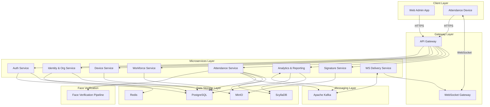
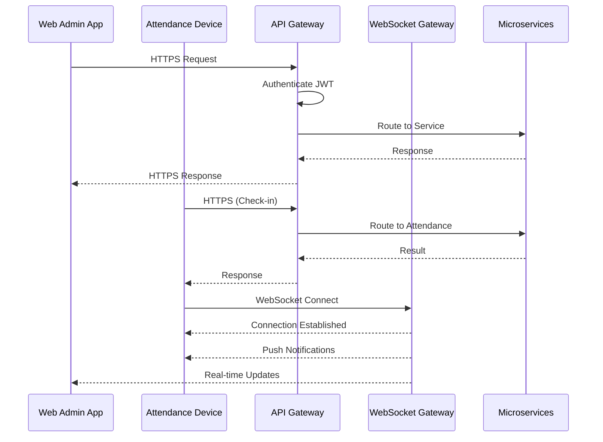
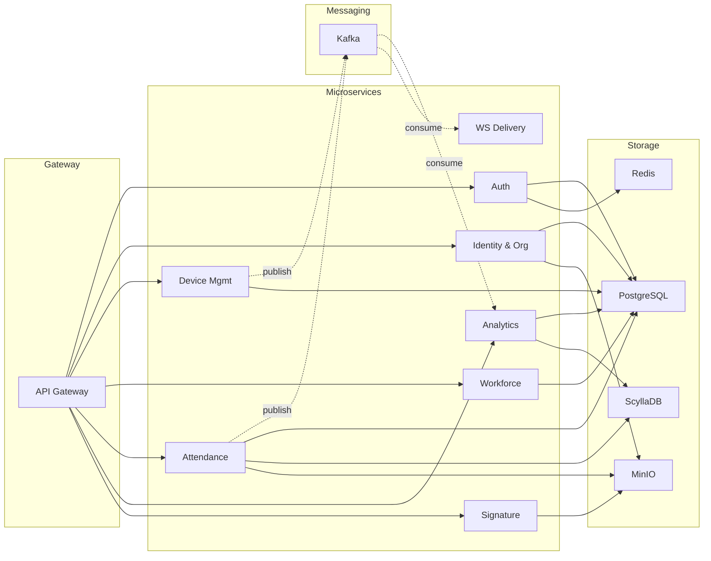
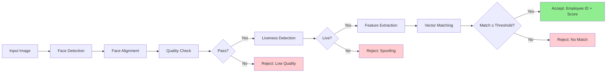
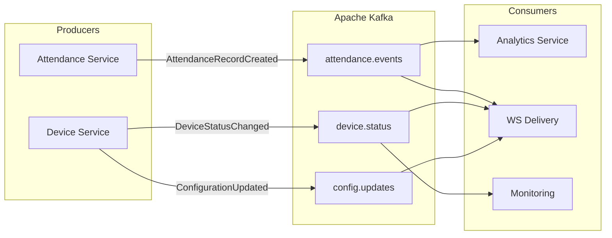
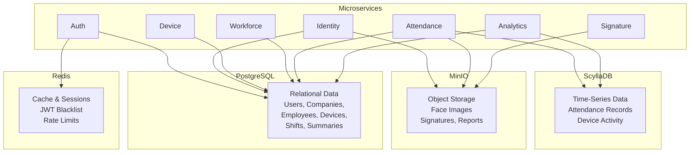
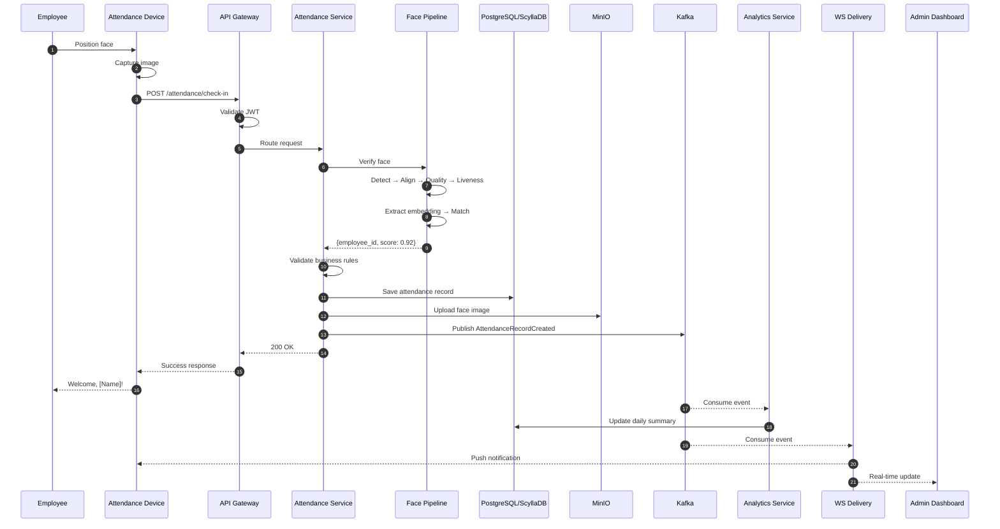

# 3.1 System Architecture

## 3.1.1 Architectural Overview

The Face Attendance SaaS platform is designed as a **multi-tenant Software-as-a-Service** solution that enables organisations to manage employee attendance through facial recognition technology. The platform follows a **layered microservices architecture**, which promotes scalability, maintainability, and independent deployment of system components.

The architecture comprises six principal layers, each with distinct responsibilities:

1. **Client Layer**: Provides user interfaces for administrators and attendance capture devices.
2. **Gateway Layer**: Serves as the unified entry point for all client requests, handling authentication, routing, and real-time communication.
3. **Microservices Layer**: Contains the core business logic distributed across loosely coupled services.
4. **Face Verification Pipeline**: A dedicated processing pipeline for facial recognition and identity verification.
5. **Messaging Layer**: Facilitates asynchronous, event-driven communication between services.
6. **Data Storage Layer**: Provides persistent storage through a polyglot persistence strategy.

This layered approach ensures that each component can be developed, tested, and scaled independently while maintaining clear boundaries between system concerns. The overall system architecture is illustrated in Figure 3.1.

[FIGURE 3.1 HERE: Overall system architecture]

---

## 3.1.2 Client Layer

The Client Layer encompasses all user-facing applications that interact with the platform. Two primary client types are supported.

### 3.1.2.1 Admin Web Application

The Admin Web Application is a browser-based single-page application designed for system administrators and company administrators. This application provides comprehensive management capabilities, including:

- **Company Management**: Creation and configuration of tenant organisations, including company profiles, settings, and subscription details.
- **User and Employee Management**: Administration of user accounts, role assignments, and employee profiles with associated facial data.
- **Device Management**: Registration, configuration, and monitoring of attendance capture devices across multiple locations.
- **Workforce Configuration**: Definition of work shifts, employee-shift assignments, and scheduling policies.
- **Attendance Monitoring**: Real-time visibility into attendance records, exception handling, and manual adjustments.
- **Reporting and Analytics**: Generation of attendance summaries, trend analyses, and exportable reports.

The application communicates with backend services through the API Gateway via HTTPS and receives real-time updates through WebSocket connections.

### 3.1.2.2 IoT Attendance Device Application

The IoT Attendance Device Application operates on dedicated hardware terminals (kiosk-mode tablets or purpose-built devices) equipped with cameras. This application is responsible for:

- **Face Capture**: Acquiring facial images of employees during check-in and check-out events.
- **Attendance Request Submission**: Transmitting captured images along with device metadata to the backend for verification.
- **Real-time Feedback**: Displaying immediate verification results to employees, including success confirmations or error messages.
- **Offline Resilience**: Queuing attendance records locally when network connectivity is unavailable and synchronising upon reconnection.

The device application maintains a persistent WebSocket connection to receive configuration updates and push notifications from the server. The communication flow between clients and backend services is depicted in Figure 3.2.

[FIGURE 3.2 HERE: Client–gateway–services communication]

---

## 3.1.3 Gateway Layer

The Gateway Layer serves as the single point of entry for all external requests, providing essential cross-cutting concerns. This layer consists of two gateway components.

### 3.1.3.1 API Gateway

The API Gateway handles all synchronous HTTP/HTTPS requests from client applications. Its primary responsibilities include:

- **Authentication and Authorisation**: Validation of JSON Web Tokens (JWT) and enforcement of role-based access control policies.
- **Request Routing**: Directing incoming requests to the appropriate microservice based on URL paths and HTTP methods.
- **Rate Limiting**: Protecting backend services from excessive request volumes through configurable rate limits per tenant, user, or endpoint.
- **Request Transformation**: Normalising request and response formats as required by downstream services.
- **Observability**: Injecting correlation identifiers for distributed tracing and logging access patterns for monitoring purposes.

### 3.1.3.2 WebSocket Gateway

The WebSocket Gateway manages persistent, bidirectional connections with client applications. Its responsibilities encompass:

- **Connection Management**: Establishing and maintaining WebSocket sessions with authenticated clients.
- **Message Routing**: Delivering real-time notifications to specific clients, tenant groups, or broadcast channels.
- **Heartbeat Monitoring**: Detecting and handling disconnections through periodic ping-pong mechanisms.
- **Event Subscription**: Allowing clients to subscribe to specific event types such as attendance results and device status changes.

This gateway enables the platform to push immediate feedback to attendance devices and live updates to administrator dashboards without requiring client polling. The interaction between clients and gateways is also illustrated in Figure 3.2.

---

## 3.1.4 Microservices Layer

The Microservices Layer contains the core business logic of the platform, distributed across eight loosely coupled services. Each service owns its domain logic and data, communicating with other services through the API Gateway for synchronous requests and the messaging layer for asynchronous events.

### 3.1.4.1 Auth Service

The Auth Service is responsible for user and device authentication. It handles credential validation, JWT token issuance and refresh, session management, and password security. This service also manages device activation workflows, ensuring that only authorised devices can submit attendance records.

### 3.1.4.2 Identity and Organisation Service

The Identity and Organisation Service manages the core entities of the multi-tenant system, including companies (tenants), users, and employees. It maintains employee profiles and their associated facial data (face embeddings), which are used for identity verification during attendance capture.

### 3.1.4.3 Device Management Service

The Device Management Service oversees the lifecycle of attendance capture devices. It handles device registration, configuration management, status monitoring, and firmware update coordination. This service maintains the mapping between devices and their assigned locations within tenant organisations.

### 3.1.4.4 Workforce Service

The Workforce Service manages work scheduling and shift assignments. It defines work shifts with their start times, end times, and associated policies such as late arrival thresholds and overtime rules. The service also handles the assignment of employees to specific shifts.

### 3.1.4.5 Attendance Service

The Attendance Service is the central orchestrator for attendance processing. Upon receiving an attendance request, it invokes the Face Verification Pipeline, validates business rules such as shift schedules and duplicate check prevention, records the attendance event, and publishes relevant events to the messaging layer. This service is the primary entry point for all attendance-related operations.

### 3.1.4.6 Analytics and Reporting Service

The Analytics and Reporting Service consumes attendance events from the messaging layer to maintain aggregated views of attendance data. It calculates daily summaries, overtime hours, and attendance statistics. This service also generates scheduled and on-demand reports in various formats.

### 3.1.4.7 Signature Upload Service

The Signature Upload Service handles the storage and management of digital signatures, which may be required for approval workflows or document signing within the platform.

### 3.1.4.8 WebSocket Delivery Service

The WebSocket Delivery Service bridges the messaging layer and the WebSocket Gateway. It consumes events from the message broker and routes them to the appropriate WebSocket sessions, enabling real-time notifications to connected clients.

The relationships between microservices and their dependencies are illustrated in Figure 3.3.

[FIGURE 3.3 HERE: Microservices component diagram]

---

## 3.1.5 Face Verification Pipeline

The Face Verification Pipeline is a dedicated processing component invoked by the Attendance Service to verify employee identities through facial recognition. The pipeline consists of several sequential stages:

1. **Face Detection**: The input image is processed to locate and extract facial regions. Algorithms such as RetinaFace or MTCNN identify bounding boxes and facial landmarks.

2. **Face Alignment**: Detected faces are geometrically normalised using affine transformations based on facial landmark positions, producing a standardised face image suitable for feature extraction.

3. **Image Quality Assessment**: The aligned face image is evaluated for quality factors including blur, brightness, occlusion, and pose angle. Images failing quality thresholds are rejected with appropriate feedback to the capture device.

4. **Liveness Detection**: Anti-spoofing checks are performed to ensure the captured image represents a live person rather than a photograph or video replay attack.

5. **Feature Extraction**: A deep neural network such as ArcFace or AdaFace extracts a high-dimensional embedding vector (typically 512 dimensions) that encodes the unique facial characteristics of the individual.

6. **Matching and Scoring**: The extracted embedding is compared against the stored embeddings of employees within the same tenant organisation using cosine similarity. The system returns the best match along with a confidence score.

The Attendance Service uses the matching result and confidence score to determine whether to accept or reject the attendance attempt. Configurable thresholds allow organisations to balance between security (higher thresholds) and user convenience (lower thresholds). The pipeline stages are depicted in Figure 3.4.

[FIGURE 3.4 HERE: Face verification pipeline]

---

## 3.1.6 Messaging Layer

The Messaging Layer provides an asynchronous, event-driven communication backbone for the platform. Apache Kafka serves as the distributed message broker, offering high throughput, durability, and fault tolerance.

Key characteristics of the messaging architecture include:

- **Event-Driven Decoupling**: Services publish events without knowledge of consumers, enabling loose coupling and independent evolution.
- **Reliable Delivery**: Kafka's log-based architecture ensures that events are durably stored and can be replayed if consumers experience failures.
- **Scalable Consumption**: Consumer groups enable horizontal scaling of event processors across multiple instances.

Principal event types flowing through the messaging layer include:

- **AttendanceRecordCreated**: Published by the Attendance Service upon successful attendance capture, consumed by the Analytics and Reporting Service and the WebSocket Delivery Service.
- **DeviceStatusChanged**: Published by the Device Management Service when device connectivity or health status changes.
- **ConfigurationUpdated**: Published when tenant or device configurations are modified, triggering cache invalidations or device updates.

This event-driven approach ensures that the Attendance Service can complete its primary function rapidly while downstream processing such as analytics aggregation and real-time notifications occurs asynchronously. The messaging architecture and topic flow are illustrated in Figure 3.5.

[FIGURE 3.5 HERE: Messaging & Kafka topics]

---

## 3.1.7 Data Storage Layer

The Data Storage Layer employs a polyglot persistence strategy, utilising different storage technologies optimised for specific data access patterns.

### 3.1.7.1 PostgreSQL

PostgreSQL serves as the primary relational database for core transactional data. It stores entities requiring ACID guarantees and complex relational queries, including:

- Companies (tenant organisations) and their configurations
- Users, employees, and role assignments
- Devices and location mappings
- Work shifts and employee-shift assignments
- Daily attendance summaries and exception records
- Audit logs and system settings

PostgreSQL is configured with a primary instance and one or more read replicas to distribute query load and provide high availability.

### 3.1.7.2 ScyllaDB (or Apache Cassandra)

ScyllaDB provides high-throughput, low-latency storage for time-series attendance data. Its distributed architecture and tunable consistency model make it ideal for:

- Raw attendance records partitioned by tenant and date
- High-frequency device activity logs
- Analytics-optimised query patterns

Data is partitioned by company and date, enabling efficient range queries for reporting while distributing load across the cluster.

### 3.1.7.3 MinIO

MinIO provides S3-compatible object storage for binary assets, including:

- Face images captured during registration and attendance
- Digital signatures and document attachments
- Generated report files
- Company logos and branding assets

Objects are organised in a hierarchical bucket structure by tenant, enabling straightforward access control and lifecycle management.

### 3.1.7.4 Redis

Redis serves as a high-performance caching layer and supports several operational use cases:

- Caching frequently accessed configuration data and user sessions
- Storing JWT token blacklists for logout enforcement
- Providing distributed locks for coordinating concurrent operations
- Supporting rate limiting counters at the API Gateway

This represents a high-level data architecture; detailed database schemas and table definitions are provided in **Appendix A – Database Design**. The data storage architecture is illustrated in Figure 3.6.

[FIGURE 3.6 HERE: Data storage architecture]

---

## 3.1.8 Example End-to-End Attendance Flow

To illustrate how the architectural components collaborate, this section describes the sequence of events when an employee checks in using an attendance device.

1. **Face Capture**: The employee approaches the attendance device and positions their face in front of the camera. The device application captures a facial image and performs preliminary liveness checks.

2. **Request Submission**: The device sends an HTTPS POST request to the API Gateway, including the captured image, device identifier, and timestamp. The request is authenticated using the device's JWT token.

3. **Gateway Processing**: The API Gateway validates the device token, extracts tenant context, and routes the request to the Attendance Service.

4. **Face Verification**: The Attendance Service invokes the Face Verification Pipeline, which processes the image through detection, alignment, quality assessment, liveness detection, feature extraction, and matching stages. The pipeline returns the matched employee identifier and confidence score.

5. **Business Rule Validation**: The Attendance Service validates the attendance against business rules, including shift schedule verification and duplicate check-in prevention within a configurable time window.

6. **Data Persistence**: Upon successful validation, the attendance record is persisted to both PostgreSQL (master record) and ScyllaDB (time-series store). The captured face image is uploaded to MinIO.

7. **Event Publication**: The Attendance Service publishes an `AttendanceRecordCreated` event to Kafka, then returns a success response to the device.

8. **Asynchronous Processing**: The Analytics and Reporting Service consumes the event and updates daily attendance summaries. The WebSocket Delivery Service consumes the same event and pushes real-time notifications to the attendance device and connected administrator dashboards.

9. **User Feedback**: The attendance device displays a welcome message with the employee's name, confirming successful check-in.

The entire synchronous flow, from request receipt to response, typically completes within 150 milliseconds under normal operating conditions. Detailed sequence diagrams illustrating these interactions were presented in Chapter 2. The end-to-end flow is summarised in Figure 3.7.

[FIGURE 3.7 HERE: End-to-end attendance flow]

---

## 3.1.9 Summary

This section has presented the system architecture of the Face Attendance SaaS platform. The layered microservices architecture provides a scalable, maintainable foundation that supports real-time facial recognition-based attendance management for multiple tenant organisations.

Key architectural characteristics include:

- **Scalability**: Horizontal scaling of individual microservices and database clusters enables the platform to accommodate growing numbers of tenants and attendance transactions.
- **Resilience**: Asynchronous event processing, retry mechanisms, and circuit breakers ensure graceful degradation under failure conditions.
- **Security**: Multi-layer authentication, tenant data isolation, and encryption protect sensitive biometric and attendance data.
- **Real-time Capability**: WebSocket connections and event-driven processing enable immediate feedback to users and administrators.
- **Extensibility**: The loosely coupled service architecture facilitates the addition of new features and integrations without disrupting existing functionality.

The following section (3.2) provides implementation details, including technology selections, deployment configurations, and development practices employed in realising this architecture.

---

# Appendix: Mermaid Diagrams

## Figure 3.1 – Overall system architecture (Mermaid)

---

## Figure 3.2 – Client–gateway–services communication (Mermaid)

---

## Figure 3.3 – Microservices component diagram (Mermaid)

---

## Figure 3.4 – Face verification pipeline (Mermaid)

---

## Figure 3.5 – Messaging & Kafka topics (Mermaid)

---

## Figure 3.6 – Data storage architecture (Mermaid)

---

## Figure 3.7 – End-to-end attendance flow (Mermaid)

