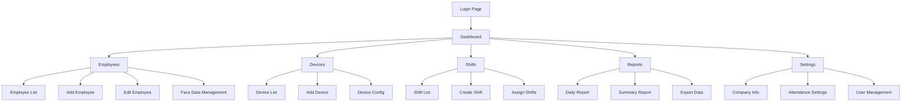
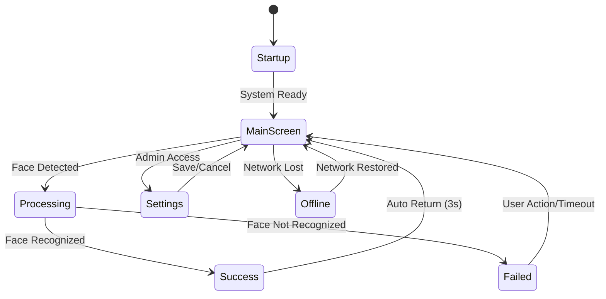

# QUY TRÌNH SỬ DỤNG VÀ TƯƠNG TÁC GIỮA CÁC TRANG

---

## **1. USER JOURNEY - HÀNH TRÌNH NGƯỜI DÙNG**

### **1.1. Company Admin Journey**

#### **Lần đầu sử dụng hệ thống:**
```
Đăng nhập → Dashboard (Welcome tour) → Cài đặt thông tin công ty 
→ Thêm nhân viên đầu tiên → Đăng ký khuôn mặt → Thêm thiết bị 
→ Cấu hình ca làm việc → Test chấm công → Hoàn tất setup
```

#### **Quy trình hàng ngày:**
```
Đăng nhập → Dashboard (xem tình hình chấm công) 
→ Kiểm tra thiết bị online → Xử lý cảnh báo (nếu có)
→ Xem báo cáo ngày → Xuất file cho kế toán
```

#### **Quy trình hàng tháng:**
```
Dashboard → Báo cáo tổng hợp → Chọn kỳ báo cáo 
→ Phân tích dữ liệu → Xuất báo cáo → Gửi cho Ban giám đốc
```

### **1.2. Employee Journey**

#### **Chấm công tại thiết bị:**
```
Đến thiết bị → Đưa mặt vào camera → Chờ nhận diện (1-2s)
→ Xem kết quả → Rời khỏi thiết bị
```

#### **Xem lịch sử chấm công:**
```
Truy cập Web App → Đăng nhập → Trang "Lịch sử của tôi"
→ Chọn kỳ xem → Xem chi tiết → In/Xuất nếu cần
```

### **1.3. System Admin Journey**

#### **Giám sát hệ thống:**
```
System Dashboard → Kiểm tra metrics → Xem alerts
→ Xử lý vấn đề → Cập nhật status → Thông báo cho customers
```

#### **Onboarding công ty mới:**
```
Tạo company account → Cấu hình gói dịch vụ 
→ Gửi thông tin đăng nhập → Hỗ trợ setup ban đầu
→ Theo dõi usage trong tuần đầu
```

---

## **2. PAGE FLOW DIAGRAMS**

### **2.1. Web App Navigation Flow**



### **2.2. Device App States Flow**



---

## **3. COMPONENT INTERACTIONS**

### **3.1. Dashboard Components**

#### **Stats Cards → Detail Views:**
- Click "Tổng nhân viên" → Navigate to Employee List
- Click "Chấm công hôm nay" → Navigate to Daily Report
- Click "Thiết bị online" → Navigate to Device List  
- Click "Đi trễ tháng này" → Navigate to Summary Report (filtered)

#### **Charts → Drill-down:**
- Click bar trong "7 ngày qua" → Daily Report cho ngày đó
- Click pie slice "Theo ca" → Shift Report
- Click timeline item → Attendance detail popup

#### **Recent Activity → Actions:**
- Click attendance record → Employee detail
- Click device status → Device config page
- Click alert → Relevant management page

### **3.2. Employee Management Flows**

#### **Add Employee Workflow:**
```
Employee List → "Thêm NV" Button → Add Employee Form
→ Fill Basic Info → Save Employee → Face Data Page
→ Upload Photos → Validate Quality → Save Face Data
→ Assign to Shifts (optional) → Complete
```

#### **Bulk Operations:**
```
Employee List → Select Multiple → Bulk Actions Menu
→ Export to Excel / Delete / Assign Shifts / Send Notifications
→ Confirmation Modal → Execute → Success Toast
```

### **3.3. Real-time Updates**

#### **WebSocket Integration:**
- **Device Status Updates:** Automatic refresh device cards
- **Attendance Notifications:** Toast messages for new check-ins
- **Alert Broadcasts:** System-wide notifications
- **Live Dashboard:** Auto-refresh stats every 30s

#### **Notification Types:**
```javascript
// Device offline notification
{
  type: "device_offline",
  message: "Thiết bị Văn phòng HN đã offline",
  severity: "warning",
  action: "/devices/123"
}

// Attendance success notification  
{
  type: "attendance_success", 
  message: "Nguyễn Văn A đã chấm công vào - 08:15",
  severity: "success",
  employee_id: "EMP001"
}
```

---

## **4. ERROR HANDLING & UX PATTERNS**

### **4.1. Loading States**

#### **Page Loading:**
- **Skeleton screens** cho tables và cards
- **Progress bars** cho file uploads
- **Spinners** cho button actions
- **Shimmer effects** cho image loading

#### **Data Fetching:**
```javascript
// Loading state pattern
const [loading, setLoading] = useState(true);
const [data, setData] = useState(null);
const [error, setError] = useState(null);

// UI shows: Skeleton → Data/Error → Success
```

### **4.2. Error States**

#### **Network Errors:**
- **No Connection:** Offline banner với retry button
- **Timeout:** "Kết nối chậm, vui lòng thử lại"
- **Server Error:** "Lỗi hệ thống, đã báo admin"

#### **Validation Errors:**
- **Form Validation:** Inline errors với red highlighting
- **File Upload:** "Ảnh không hợp lệ, vui lòng chọn file JPG/PNG"
- **Business Logic:** "Nhân viên đã chấm công trong ca này"

#### **Permission Errors:**
- **Access Denied:** Redirect to appropriate page
- **Feature Locked:** Upgrade prompt modal
- **Session Expired:** Auto-redirect to login

### **4.3. Success Feedback**

#### **Toast Notifications:**
```javascript
// Success patterns
showToast("Thêm nhân viên thành công!", "success");
showToast("Đã xuất báo cáo Excel", "info", { 
  action: "Download",
  handler: downloadFile 
});
```

#### **Confirmation Dialogs:**
```javascript
// Delete confirmation
{
  title: "Xóa nhân viên", 
  message: "Bạn có chắc muốn xóa Nguyễn Văn A?",
  confirmText: "Xóa",
  cancelText: "Hủy",
  severity: "danger"
}
```

---

## **5. SEARCH & FILTERING PATTERNS**

### **5.1. Global Search**

#### **Quick Search (Header):**
- **Scope:** Employees, Devices, Attendance records
- **Results:** Dropdown với grouped results
- **Actions:** Navigate to detail hoặc list filtered

#### **Advanced Search:**
```javascript
// Search parameters
{
  query: "nguyễn",
  filters: {
    department: "IT",
    status: "active", 
    dateRange: "2024-01-01,2024-01-31"
  },
  sort: "name_asc"
}
```

### **5.2. Filter Components**

#### **Date Range Picker:**
- **Presets:** Hôm nay, 7 ngày, Tháng này, Tháng trước
- **Custom Range:** Calendar với từ ngày - đến ngày
- **Shortcuts:** T2, T3, T4, T5, T6, T7, CN buttons

#### **Multi-Select Filters:**
```javascript
// Filter state
{
  departments: ["IT", "Marketing"], 
  shifts: ["Sáng", "Chiều"],
  devices: ["Device_001", "Device_002"]
}
```

### **5.3. Sorting & Pagination**

#### **Table Sorting:**
- **Click column header:** Toggle asc/desc
- **Multi-column sort:** Hold Shift + click
- **Sort indicators:** Arrows với active state

#### **Pagination Options:**
- **Items per page:** 10, 25, 50, 100
- **Jump to page:** Input field
- **Total count:** "Hiển thị 1-25 của 156 kết quả"

---

## **6. MOBILE-SPECIFIC INTERACTIONS**

### **6.1. Touch Gestures**

#### **Swipe Actions (Tables):**
- **Swipe left:** Reveal action buttons (Edit, Delete)
- **Swipe right:** Mark as favorite/bookmark
- **Long press:** Select mode với checkboxes

#### **Pull to Refresh:**
- **Dashboard:** Refresh all data
- **Lists:** Reload current page
- **Reports:** Refresh calculations

### **6.2. Mobile Navigation**

#### **Bottom Tab Bar:**
```
Dashboard | Employees | Devices | Reports | More
    🏠         👥         📱        📊      ⋯
```

#### **Collapsible Sidebar:**
- **Hamburger menu:** Slide-out navigation
- **Category sections:** Với expand/collapse
- **Quick actions:** Prominent buttons

### **6.3. Form Adaptations**

#### **Input Methods:**
- **Date inputs:** Native date picker
- **Select dropdowns:** Native select/action sheet
- **File upload:** Camera + Gallery options
- **Numeric inputs:** Numeric keyboard

---

## **7. ACCESSIBILITY FEATURES**

### **7.1. Keyboard Navigation**

#### **Tab Order:**
```
Header → Main Nav → Primary Content → Secondary Actions → Footer
```

#### **Keyboard Shortcuts:**
- **Ctrl+/** : Open search
- **Ctrl+D** : Go to dashboard  
- **Ctrl+N** : New employee/device/shift
- **Ctrl+S** : Save current form
- **Esc** : Close modal/cancel action

### **7.2. Screen Reader Support**

#### **ARIA Labels:**
```html
<!-- Loading states -->
<div aria-live="polite" aria-busy="true">
  Đang tải dữ liệu...
</div>

<!-- Form validation -->
<input 
  aria-describedby="email-error"
  aria-invalid="true"
/>
<div id="email-error" role="alert">
  Email không hợp lệ
</div>
```

#### **Focus Management:**
- **Modal open:** Focus first input
- **Modal close:** Return to trigger element  
- **Page navigation:** Focus main heading
- **Form submission:** Focus first error/success message

### **7.3. High Contrast Mode**

#### **Color Adaptations:**
- **Text contrast:** Minimum 4.5:1 ratio
- **Interactive elements:** 3:1 ratio
- **Focus indicators:** 2px solid outline
- **Status colors:** Icon + text combinations

---

## **8. PERFORMANCE OPTIMIZATION**

### **8.1. Loading Strategies**

#### **Progressive Loading:**
```
Critical CSS → Above-fold content → Below-fold → Non-critical JS
```

#### **Lazy Loading:**
- **Images:** Intersection Observer
- **Tables:** Virtual scrolling cho large datasets  
- **Components:** Route-based code splitting
- **Charts:** Load library chỉ khi cần

### **8.2. Caching Strategies**

#### **Static Assets:**
```javascript
// Cache headers
Cache-Control: public, max-age=31536000  // 1 year for assets
Cache-Control: public, max-age=300       // 5 min for API data
```

#### **Application Data:**
- **User preferences:** localStorage
- **Form drafts:** sessionStorage  
- **Employee list:** IndexedDB (offline access)
- **Images:** Cache API (Service Worker)

### **8.3. Bundle Optimization**

#### **Code Splitting:**
```javascript
// Route-based splitting
const Dashboard = lazy(() => import('./Dashboard'));
const Reports = lazy(() => import('./Reports'));

// Feature-based splitting  
const ChartComponent = lazy(() => import('./Chart'));
```

#### **Tree Shaking:**
- **Import only used functions:** `import { format } from 'date-fns'`
- **Conditional imports:** Dynamic imports cho optional features
- **Bundle analysis:** Regular monitoring với webpack-bundle-analyzer

---

Tài liệu này cung cấp hướng dẫn chi tiết về cách các trang giao diện tương tác với nhau, quy trình người dùng, và các pattern UX/UI được sử dụng trong hệ thống Face Attendance SaaS. Nó bổ sung cho tài liệu mô tả trang chính và cung cấp góc nhìn kỹ thuật về implementation.